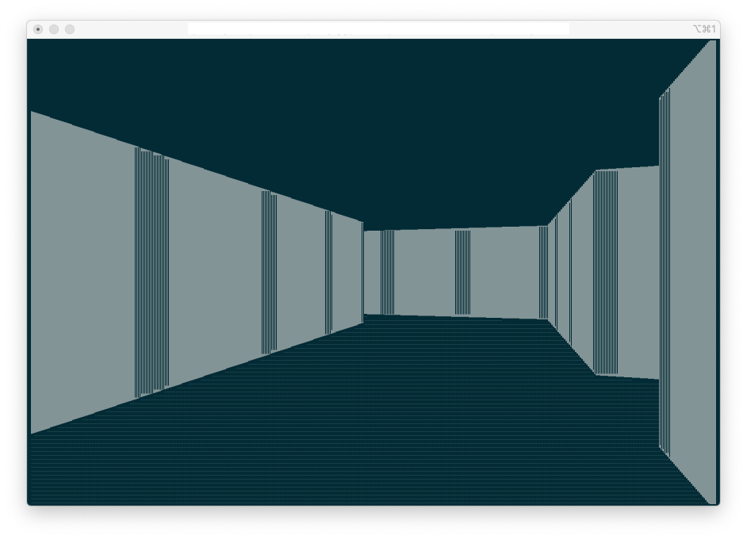

## Raycasting in the Terminal

Just a bit of fun. After watching OneLoneCoder's [First Person Shooter Video](https://youtu.be/xW8skO7MFYw), 
inspiration struck and I had an idea to potentially get rid of the "blocky" appearance that would seem to
be inevitable in a console based raycaster. So this is a C++20 raycaster using ncurses which is
functionally more or less the same as in OneLoneCoder's video, but with the edges smoothed a bit.

This is an example of what a scene looks like with blocky edges in a fairly
high resolution terminal:

This is the same scene with the edges smoothed:

The smoothing is achieved by rendering the walls as solid blocks and using the fractional component
of the wall height for a given column to choose from the fractional block characters: 

- U+2581	▁
- U+2582	▂
- U+2583	▃
- U+2584	▄
- U+2585	▅
- U+2586	▆
- U+2587	▇
- U+2588	█

So if the wall height is for instance 4.5, then four full block characters are drawn for the wall
and additional fractional block characters are added to the top and bottom of those four blocks. 
In this case it would be two quarter blocks to make up the missing 0.5 units.

It's quite simple to implement and has the nice property that all the necessary information is
already available and no additional rays need to be cast. 